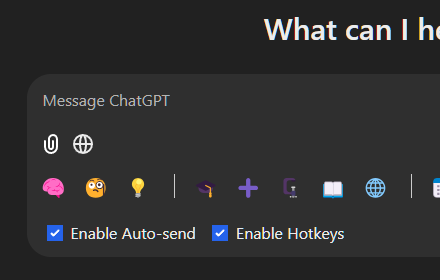
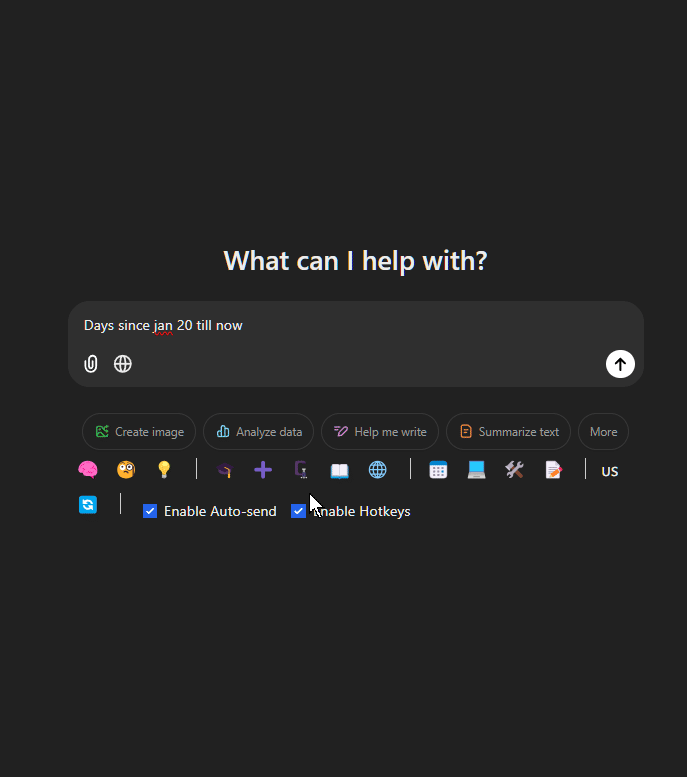

# [OneClickPrompts:  Your Quick Prompt Companion for Multiple AI Chats!](https://chromewebstore.google.com/detail/chatgpt-quick-buttons-for/iiofmimaakhhoiablomgcjpilebnndbf)

---
**[>>>➡️Install OneClickPrompts from Chrome Web Store<<<](https://chromewebstore.google.com/detail/chatgpt-quick-buttons-for/iiofmimaakhhoiablomgcjpilebnndbf)**
---

**📢  Important Name Change:  "ChatGPT Quick Buttons" is now "OneClickPrompts"! 📢**

# Effortless Prompts Across Your Favorite AI Chats: One Click Away!

**Boost your productivity across multiple AI platforms with OneClickPrompts!  Insert your frequently used prompts with a single click in:**

* **ChatGPT**
* **DeepSeek Chat**
* **Google AI Studio**
* **Google Gemini**
* **Claude**
* **Microsoft Copilot (formerly Bing Chat)**
* **Grok.com**

Tired of retyping the same prompts in your AI chats?  **OneClickPrompts** lets you create custom buttons for your go-to prompts, or choose from pre-defined options. These buttons appear directly in the input field of your favorite AI chat platforms, dramatically saving you time and making your conversations smoother and more efficient, no matter where you're chatting! In Popup, you can manage and ognaize the prompt library.

**Get set up in seconds!** OneClickPrompts is free, open-source, and respects your privacy – no data tracking. Your prompts are securely stored in your browser's sync storage.

## Key Features

- One-Click Prompt Insertion: Instantly add your custom prompts to ChatGPT, DeepSeek Chat, Google AI Studio, Claude, Copilot, Gemini, Perplexity, and more with a single click.
- Multi-Platform Support:  Works seamlessly across ChatGPT, DeepSeek Chat, Google AI Studio, Claude, Copilot, Gemini, Perplexity, and Grok (and growing!).
- Customizable Buttons:  Easily create buttons for any prompt you use regularly.
- Prompt Profiles: Organize your buttons into profiles for different tasks, projects, AI platforms, or writing styles.
- Visual Icons & Emojis:  Personalize buttons with emojis or characters for quick visual recognition.
- Auto-Send Convenience:  Optionally send messages automatically when you click a button. Use Shift-click to toggle auto-send behavior.
- Keyboard Shortcuts (Alt + 1-9):  Quickly access your first nine buttons with keyboard shortcuts for maximum speed.
- Button Separators:  Visually organize your prompt buttons with customizable separators for a cleaner workspace.
- **Token Counter**: Monitor your prompt token usage with a built-in token counter that supports multiple counting algorithms for different speed/accuracy needs.
- **Floating Panel & Prompt Queue:** Summon a draggable, resizable floating panel (click the '🔼' button) that contains the new Queue feature. Chain multiple prompts to send them sequentially with a configurable delay, perfect for complex, multi-step tasks.
- **Cross-Chat Superpowers:**
    - **Copy & Paste Prompts:** Ever wanted to ask the same question to different AIs? Copy a prompt from one site's input box and instantly paste it into another.
    - **Multi-Chat Broadcast:** A power-user feature to send a prompt to *every* supported AI chat tab you have open at once. Great for comparing responses across models. You can "shield" a tab to prevent it from receiving broadcasts.

## Get Started with OneClickPrompts in 3 Easy Steps:

1. Install OneClickPrompts: Add the extension from the Chrome Web Store.
2. Open Settings: Click the OneClickPrompts icon in your Chrome toolbar.
3. Create & Customize: Add profiles, create custom buttons with your favorite prompts, and personalize them with icons.

## AI generated codebase overview - DeepWiki

[Link to codebase overview](https://deepwiki.com/MaxITService/OneClickPrompts/1-oneclickprompts-extension-overview)
{{ ... }}
May be not 100% accurate but gives idea about what is happening

## Troubleshooting

If you encounter any issues, simply reload your browser. For persistent problems, please don't hesitate to reach out for support.  Uninstalling the extension is clean and leaves no trace.

## License

**Do whatever you like!**  Attribution is appreciated – a link back to me and the Chrome Web Store listing would be great.  Pull requests with improvements are welcome!

---
